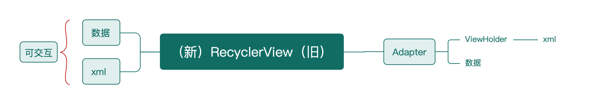

## 乂架构

### 项目目的

    简化代码，争取做到最小代码实现功能。

    PS：R2部分逻辑参照butterknife项目

    项目目前处于初期建设阶段，文档粗略，功能可参照app里的demo。

### 项目功能

1.基础Activity、ViewModelActivity、ViewBindingActivity、Fragment
    
2.类似ButterKnife的功能注解
    
3.可定制宽高、动画的Dialog，DialogFragment
    
4.快速搭建列表 

5.快速集成retrofit-okhttp网络请求，便捷网络请求

### 项目集成

    1.添加远程地址
    allprojects {
        repositories {
            ...
            maven { url 'https://jitpack.io' }
        }
    }
    
    2.添加依赖
    dependencies {
        依赖全部
        implementation 'com.github.walgr.Quick:Quick:latest'

        看需求依赖
        implementation 'com.github.walgr.Quick:QuickNetwork:latest'
        implementation 'com.github.walgr.Quick:QuickDialog:latest'
        implementation 'com.github.walgr.Quick:QuickRecyclerView:latest'
    }

### 未来功能

    1.父选择基类支持悬浮和展开收起功能 已实现

    2.BindFragment支持ViewPager2 已实现

    3.可刷新List支持请求接口后自动加载 已实现
    
    4.布局View支持请求接口后自动映射赋值 已实现

    5.布局xml支持接口请求并自动赋值 已实现

    6.列表Item可定义上中下边距
    
    7.布局xml可嵌套功能组件 框架搭建中...

    8.弹窗自适应内容高度  已实现
